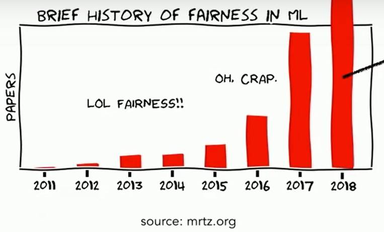
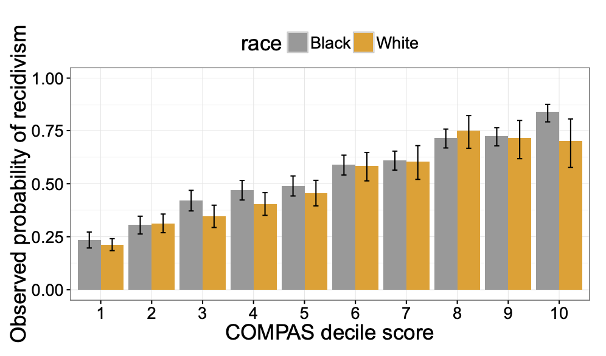
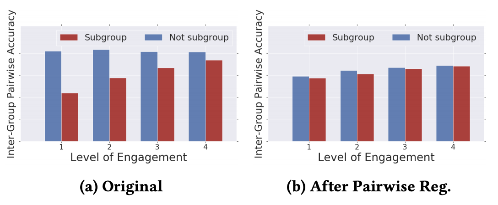

```{r setup, include=FALSE}
knitr::opts_chunk$set(echo = TRUE)
```

#In what ways do you think Recommender Systems reinforce human bias? 

The study of how machine learning provide "fair" results seems to be an area of research which is growing. A lot of the work seems to be around classification and its impact of decision making. For example in criminal justice, loan lending, school admissions.      





But in all of these cases, a definition of "fairness" is necessary. In this discussion we first look into how fairness is defined, look into some of the classification cases available in literature, and then relate those concepts to recommender system.

#Defining "fairness"

To be able to understand if a recommender is guilty of reinforced human bias, or it is being unfair, we should start by defining what is fair in the first place. At least in the area of classifiers, the concept of fairness revolves around the idea of algorithm being guilty of arbitrary, inconsistent or faulty decision making. These seem to be rather soft definitions. Arvind Narayanan tries to formalize this definition more concretely in this "21 fairness definition" tutorial". In this work the author present the idea of statistical and societal bias, group fairness, individual fairness, provocations, ineffectiveness of blindness. All of these relate to general machine learning and thus recommenders.

As we can see many of these definitions of fairness apply to the core of the algorithms in machine learning, including recommendation systems.

###Statistical bias  

Difference between an estimator’s expected value and the true value. As we have seen with out recommenders, bias can be an effect of the data being used to train our model. If the data is bias, then the results will be.

###Group Fairness

Do outcomes systematically differ between groups. The idea here is that outcomes should be independent of individuals being part of a group, but how do we define groups? By adding a feature to our recommender which by definitions will add the user/item to a group, we are already adding this unfairness. Contested groups are gender and race. In recommenders for instance we might be adding unfairness if we add either of these to our input list. In collaborative filtering, it would seem this has no effect since we are relating to users or items and not a gender or race classification. But if we think of a cold start and the first few user are from a certain group, our recommender would thus grown in an unfair way.

###Individual Fairness

Refers to selecting thresholds for our decision making and how it is hard to select the same one for all individuals. Recommenders are by their nature applied to groups, of users or items. How do we account for the intricacies of individuals. In ML adding more features might help account for these details, but we also run into the risk of overfitting our model and not being able to generalize.

#Fairness in classification

This is a topic which has received a fair amount of study. Alexandra Chouldechova provides a formal definition of fairness in classification by stating that: a score is test fair or well calibrated, if it reflects the same likelihood of outcome irrespective of an individuals or classification subject's group membership. This seems to be consistent with the definitions of fairness stated above. Her study is centered around re-incarceration. The figure below shows a graph of some of their findings.



#Fairness in recommendations

As with any problem it is important to be able to measure the issue in order to be able to address it. Using pair wise comparisons is presented as a way to do this, with regularization being a way to ameliorate fairness. With pair wise comparisons, the fairness of a classifier is quantified by comparing either its false positive rate and/or false negative rate. Regularization is very common in ML, and the ALS algorithm is an example of a recommender which has a regularization term. The graph below shows how regularization has closed the gap between different groups in a recommender.



Following this pair-wise metric, three definitions of fairness are propossed:

##Pairwise fairness

"A model fθ with ranking formula g is considered to obey pairwise fairness if the likelihood of a clicked item being ranked above another relevant unclicked item is the same across both groups."

###Intra-Group Pairwise Fairness

"A model fθ with ranking formula g is considered to obey intra-group pairwise fairness if the likelihood of a clicked item being ranked above another relevant unclicked item from the same group is the same independent of group"

###Inter-Group Pairwise Fairness

"A model fθ with ranking formula д is considered to obey inter-group pairwise fairness if the likelihood of a clicked item being ranked above another relevant unclicked item from the opposite group is the same independent of group"

#Delayed effects of fairness

A last important aspect of machine learning and recommender fairness is its effects long term. There is an argument over how decisions are taken with classifiers and recommenders systems change the underlaying population over time. The point is that if recommenders are fair they should promote the well being of the groups they affect, the user for instance. But the effects might be felt over time, not simply at a static point in time. Here again a regularization parameter is proposed. By adding this regularization parameter to the objective formula, "soft" formulations of fairness can be address, that is effect coming from the stringent rules setup in a recommender or classifier due to the features or data used to train it.

#Conclusion

The concept of fairness in ML in general seems to be picking up steam. A lot of literature exist around classifiers, where objective formulas are optimized to best fit a set of training data. Unfairness can derive from both the features and the data being used. Identifying fairness should start by defining what it is in the first place. Once a definition is set, including regularization parameters in the optimization process can help ameliorate any data overfitting which results in unfair algorithms. Some recommender algorithms produce their output by optimization, such as ALS, but other collaborative approaches heavily rely on input data. In these cases proper section of features becomes critical. Although adding certain variables to our recommender, such as gender or race, might improve the measured performance of the recommender, they also introduce elements of bias and unfairness. This issue can become even more pronounced if a black box approach is used, in which it is hard to show how the algorithm is calculating its results. The concepts in SVD's are a good example, where these might or might not have true real meaning, but are never the less used to formulate answers.

In general a balance must be reached. Recommenders by their nature will and should always be but under the microscope. The effect on the user should always be kept in mind, but can't always be well understood. Unintended consequences to algorithm design will always be present. So even as automatic ways of measuring fairness are designed, fresh looks into recommenders' fairness should always be welcomes.

#References

Delayed Impact of Fair Machine Learning. Microsoft Research. https://www.bing.com/videos/search?q=macine+learning+is+not+fair&&view=detail&mid=7C74BB9839E716A219C47C74BB9839E716A219C4&&FORM=VRDGAR&ru=%2Fvideos%2Fsearch%3Fq%3Dmacine%2Blearning%2Bis%2Bnot%2Bfair%26FORM%3DHDRSC4

Fairness and machine learning. Solon Barocas, Moritz Hardt, Arvind Narayanan. https://fairmlbook.org/

21 fairness definition. Arvind Narayanan. https://shubhamjain0594.github.io/post/tlds-arvind-fairness-definitions/

Fair prediction with disparate impact:A study of bias in recidivism prediction instruments. Alexandra Chouldechova. https://arxiv.org/pdf/1610.07524.pdf

Fairness in Recommendation Ranking through Pairwise Comparisons. http://alexbeutel.com/papers/kdd2019_pairwise_fairness.pdf

